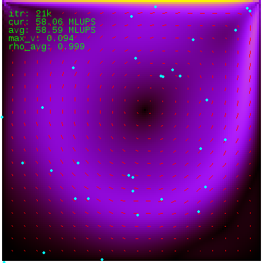
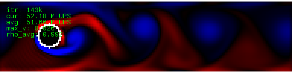
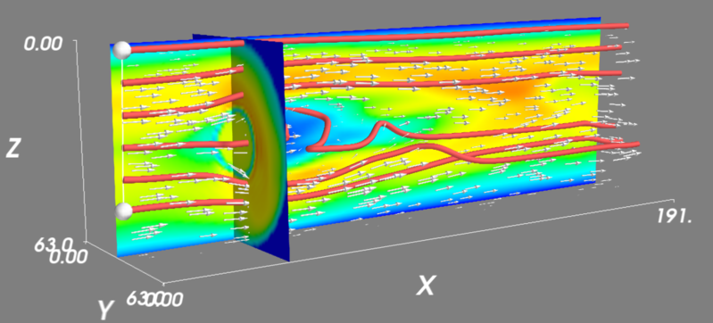

Examples and test cases
=======================

Several sample simulations are included in the Sailfish code repository.  They serve to both
illustrate the capabilities of the solver, as well as to test the correctness of the simulations
by comparing their results to data from the literature or other CFD solvers.

Most of the examples can be both run interactively, and as a part of a regression test.
To run them interactively, the ``PYTHONPATH`` environment variable has to be set so that
the ``sailfish`` module can be imported::

    export PYTHONPATH=$PWD:$PYTHONPATH
    cd examples
    python lbm_ldc.py

2D examples
-----------

Lid-driven cavity
^^^^^^^^^^^^^^^^^
The code for this example is located in ``examples/lbm_ldc.py``.

This is a standard computational fluid dynamics test problem.  The simulation domain is a
square, with no-slip boundary conditions on three walls and a velocity boundary condition
on the top, imposing horizontal velocity on the fluid.

This example is currently not used as a regression test, but some reference data for the
velocity profiles is collected in the ``regtest/ldc_golden`` directory in the Sailfish
code repository.

The image illustrates fluid velocity visualized in the ``rgb1`` mode.  The cyan circles are
tracer particles.  The red lines depict the velocity field.

Poiseuille flow
^^^^^^^^^^^^^^^
The code for this example is located in ``examples/lbm_poiseuille.py``.

The fluid flows in a 2D pipe and a no-slip boundary condition is imposed at the pipe walls.  The flow
is driven either by a global body force (``--drive=force``, default) or by a pressure gradient
(``--drive=pressure --stationary``).  The ``--stationary`` command line argument can be used to
start with the correct velocity profile if the force driving is used, or to start the
simulation with the correct pressure profile if the pressure driving is used.

This flow configuration is one of the few cases which can be solved analytically.  The point
of the test is to make sure that the generated velocity profile is the same as the analytical
solution (i.e. parabolic, with maximum velocity at the center of the channel).

This example is also used as a part of the automated regression test in ``regtest/poiseuille.py``,
see :doc:`regtest-poiseuille2d` for results.

Flow around a cylinder
^^^^^^^^^^^^^^^^^^^^^^
The code for this example is located in ``examples/lbm_cylinder.py``.

The classes in this example are derived from the ones used in the Poiseuille test, so the
geometry and available command line options are exactly as described in the previous
section.  A circular obstacle is added at the axis of the channel.  If the Reynolds number
is in the correct range, a vortex shedding process occurs and vortices detaching periodically
from the obstacle can be observed.

This example is currently not used as an automated regression test.

Von Kármán vortex street.  The image illustrates vorticity visualized in the ``2col`` mode.

3D examples
-----------

Poiseuille flow
^^^^^^^^^^^^^^^
The code for this example is located in ``examples/lbm_poiseuille_3d.py``.

This example is like the 2D Poiseuille flow, but the pipe is now a proper cylinder with a
circular cross section.  The flow can currently only be driven by a global body force.

The flow in this geometry is, like its 2D counterpart, solvable analytically and the result
is also a parabolic velocity profile.

This example is used as a part of the automated regression test in ``regtest/poiseuille.py``,
see :doc:`regtest-poiseuille3d` for results.

Flow around a sphere
^^^^^^^^^^^^^^^^^^^^
The code for this example is located in ``examples/lbm_sphere_3d.py`` and ``examples/lbm_sphere_force_3d.py``.

This example comes in two variants.  The first one is a direct counterpart of the flow around
a cylinder example in 2D.  The classes are derived from the 3D Poiseuille example, the
only difference being the spherical obstacle placed on the axis of the pipe.  The obstacle
is formed by no-slip nodes.

The image illustrates the velocity field of the fluid.  The red tubes depict streamlines.

In the second and more useful variant, the flow is driven by velocity boundary conditions
at the inlet and walls of the pipe.  This corresponds to the physical problem of a moving
sphere in a pipe with stationary fluid, as seen from the frame of reference comoving with
the sphere.

This example is interesting, because it makes it possible to calculate the drag force
exerted on the sphere by the fluid.  The value of the drag coefficient can then be compared
with an approximate theoretical prediction or with experimental data.  In order to see the
computed drag coefficient, run the example in the batch mode with verbose output (``./lbm_sphere_force_3d.py --batch -v``).
You can also select different Reynolds numbers using the ``--re=N`` command line option.

This example is also used as a part of the automated regression test in ``regtest/drag_coefficient.py``,
see :doc:`regtest-drag_coefficient` for results.
